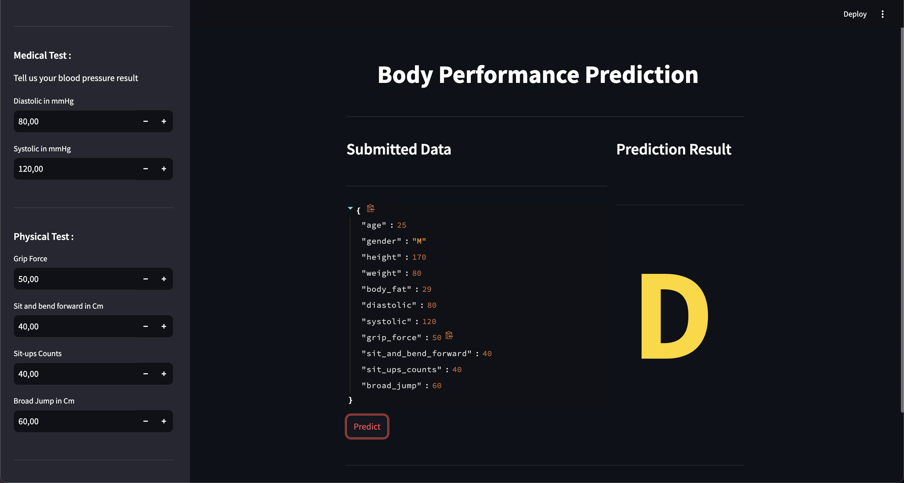

# Machine Learning Zoomcamp Midterm Project : Body Performance Prediction

## Description

This Project aims to create a machine learning model that can be used to predict an individual's physical body performance grade (class: A, B, C, D) based on physical attributes, fitness indicators, and demographic information. 

The dataset includes a range of metrics that represent health and physical fitness, such as age, gender, body fat percentage, blood pressure, grip strength, flexibility, and jump performance.The problem can be framed as a multiclass classification task, where the goal is to predict one of the four performance grades (A, B, C, D) based on the input features.

## Problem Statement

The goal of this project is to create a predictive model that can estimate an individual's body performance grade. After predicting the class (A, B, C, or D), users can receive personalized recommendations on how to improve their fitness levels and body composition based on their predicted grade by consulting a fitness expert.

## How to Run the Project

The machine learning model is loaded from a pre-trained `.bin` file, and the API is exposed through a simple Flask app running inside a Docker container.

### Prerequisites

Before running the project, ensure that the following are installed on your system:

- **Docker**: [Install Docker](https://docs.docker.com/get-docker/)
- **Python**: Python 3.8 or higher
- **Git**: For version control (optional)
- **Streamlit**: Install Streamlit using `pip install streamlit`

### Steps to Run the Project

Follow these steps to get the Flask application running with your machine learning model inside Docker:

#### 1. Clone the Repository

```bash
git clone https://github.com/yourusername/machine-learning-flask-docker.git
cd machine-learning-flask-docker
```

#### 2. Build the Docker Image

```bash
docker build -t body-performance-prediction .
```

#### 3. Run the Docker Container

```bash
docker run -p 9696:9696 body-performance-prediction
```
the model API will be accessible at `http://localhost:9696/predict`.

#### 4. Run the Streamlit App

```bash
streamlit run frontend.py
```

The application will be accessible at `http://localhost:8503`.


